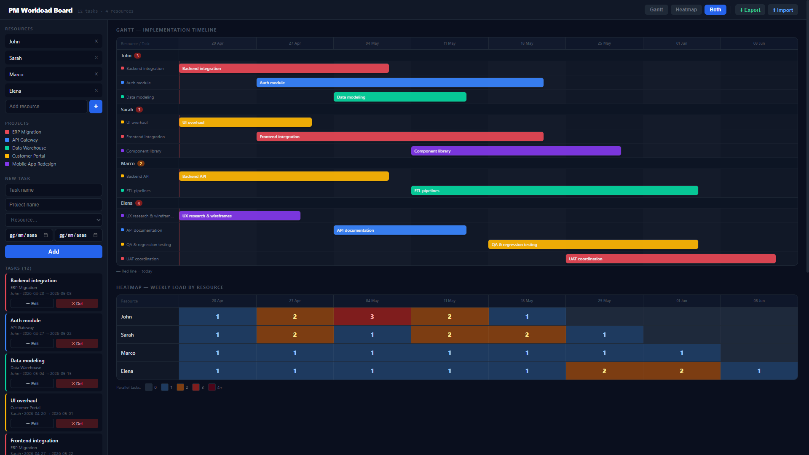

# ◈ PM WORKLOAD BOARD

> *"If the team looks slow, show them the bars. If they still don't believe you, show them the heatmap."*

**[→ Open live version](https://danilomagro.github.io/gantt-heatmap/pm-workload-board.html)**

A single-file **cross-project Gantt and capacity heatmap tool** for project managers handling multiple simultaneous implementations. No backend, no dependencies to install, no build step. Just open `pm-workload-board.html`.



---

## The problem it solves

Managing 5+ parallel implementations across a team? When management asks why delivery is slow, gut feeling doesn't cut it. This tool gives you an **objective, inattackable visual** — a Gantt that shows what's running and when, and a heatmap that derives team load automatically from the same data.

The heatmap is never filled in manually. Red means red because the bars say so.

---

## Features

| | |
|---|---|
| **Cross-project Gantt** | Timeline grouped by resource, bars coloured by project, red line = today, click bar to edit |
| **Day / Week / Month zoom** | Switch timeline granularity — day view shows weekends dimmed, week view shows ISO week numbers (W19…), month view gives a bird's-eye overview |
| **Capacity Heatmap** | Derived automatically from Gantt — resource × week grid, blue → amber → red by parallel task count |
| **Resource & Project filters** | Focus either view on one person or one project — filters compose, heatmap always shows real total load |
| **Multi-resource tasks** | Assign a task to multiple people — load propagates to each resource in both views |
| **Milestone markers** | Vertical overlays on the Gantt with custom label and colour — go-live dates, UAT freezes, deployment windows |
| **Task notes** | Optional free-text notes per task, visible on hover, with a subtle dot indicator on the bar |
| **Completion %** | Optional progress field per task — thin strip below the Gantt bar, high-contrast colour |
| **Drag & drop rescheduling** | Drag bars left/right to shift task dates; click without moving still opens edit |
| **Light / Dark theme** | Toggle between themes, preference saved in localStorage |
| **Export / Import JSON** | Full data portability — sync between devices or share snapshots with your team |
| **Print / PDF export** | Browser print dialog, landscape layout, sidebar hidden, colours preserved |
| **Synchronized horizontal scroll** | Both views scroll in sync when tasks span many weeks; resource column stays fixed |
| **Keyboard shortcuts** | Enter to submit task form, Esc to cancel |
| **Sample data** | One-click load of a realistic 18-week scenario — instant onboarding |

---

## Usage

```bash
git clone https://github.com/danilomagro/gantt-heatmap.git
cd gantt-heatmap
```

Open `pm-workload-board.html` in your browser — no server needed, works offline after first load.

**To try it immediately**: click **Load sample data** in the empty state — a realistic 18-week scenario across 3 resources, 5 projects, and 3 milestones loads instantly. No file needed.

---

## Technical notes

- Single HTML file — React 18 + Babel standalone loaded from CDN, everything else self-contained
- Data stored in `localStorage` — survives page reloads, no account required
- Nothing leaves your machine

---

## The making of

Most tools like this don't exist as single HTML files you can double-click. They're SaaS products, Jira plugins, or Excel macros that require setup, licenses, or IT approval.

This one started as a real need — a PM who wanted something lightweight, portable, and credible enough to show to management. No setup, no explanations required.

The implementation was handled entirely by **[Claude Code](https://claude.ai)** (Anthropic) through an iterative session. No code was written by hand — every feature was specified, refined, and corrected through natural language.

> **[Danilo Magro](https://www.linkedin.com/in/danilo-magro/)**'s role: the problem, the vision, the UX decisions, and the relentless "yes but what if..."  
> Claude's role: everything that runs in the browser.

---

## Status

🚧 **Work in progress** — actively developed.

### Recently shipped

- [x] Resources section: collapsible + chip display
- [x] Milestones section: collapsible
- [x] Tasks section: collapsible
- [x] Collapsible headers: full-row hover + larger chevron (∨/›)
- [x] Sidebar toggle button (☰ in header)
- [x] Undo toast for accidental task / resource / milestone deletions (5 s window)
- [x] Task list sorted by start date
- [x] Date validation — end date must be ≥ start date
- [x] Import validation — structural check before accepting a JSON file
- [x] Persistent sidebar section state — collapsed/expanded remembered across reloads
- [x] Favicon — inline SVG emoji, no extra files needed
- [x] Drag & drop rescheduling — drag bars to shift dates, click still opens edit form
- [x] Completion % — optional field, strip below bar, high-contrast colour per theme
- [x] Gantt bar tooltip — enriched with duration and completion %
- [x] Sample data button — inline in empty state, confirmation dialog if data exists
- [x] Keyboard shortcuts — Enter to submit, Esc to cancel
- [x] Day / Week / Month granularity toggle — switch timeline zoom; ISO week numbers (W19, W20…) in week view; weekend columns dimmed in day view; preference saved in localStorage

### Backlog

| Priority | Item |
|---|---|
| Medium | Read-only share link — encode board as URL fragment, open in view-only mode |
| Medium | Print layout optimisation for large datasets — auto-scale or date range selector |

---

## License

MIT — do whatever you want with it.  
If you're a PM drowning in parallel projects, I hope this helps.
