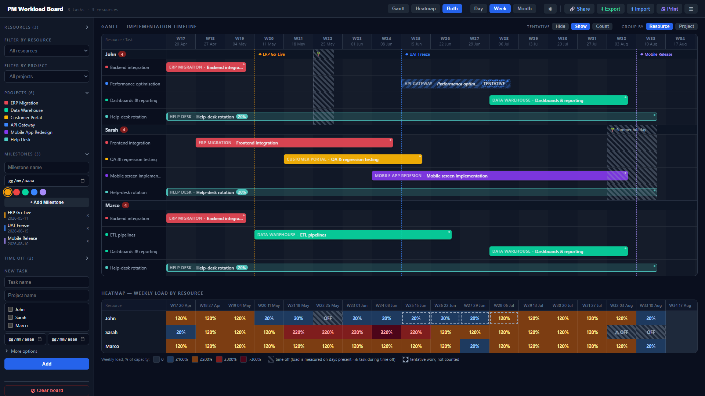

# ◈ PM WORKLOAD BOARD

[](https://danilomagro.github.io/gantt-heatmap/pm-workload-board.html)
[](https://github.com/danilomagro/gantt-heatmap/releases)
[](LICENSE)

[](https://claude.com/claude-code)

> *"If the team looks slow, show them the bars. If they still don't believe you, show them the heatmap."*

A **cross-project Gantt and capacity heatmap** for project managers running many implementations in parallel. One HTML file: no backend, no install, no account.

**[→ Open the live version](https://danilomagro.github.io/gantt-heatmap/pm-workload-board.html)** and click **Load sample data**.



---

## Why it exists

When management asks why delivery is slow, gut feeling doesn't cut it. This board gives you an **objective, unassailable picture**: a Gantt of what runs when and who is on it, and a heatmap of each person's weekly load **computed from those same bars**.

The heatmap is never filled in by hand. Red means red because the bars say so.

---

## What it does

### Plan the work
- **Cross-project Gantt**, grouped **by person** (bars read `PROJECT · task`) or **by project** (people involved underneath)
- **Drag** bars to reschedule, **drag an edge** to change start or end, **click** to edit
- **Multi-person tasks**, **notes**, **completion %**, **milestones** (go-live, UAT freeze…)
- **Undo / redo** any change: drags, edits, deletions, even Clear board (**Ctrl+Z** / **Ctrl+Y**, or ↶ ↷)
- **Day / Week / Month** zoom, and **Overview**: one row per person or project, thin bars, the whole timeline fitted to the window. Every task on one screen, ready for a slide

### Read the load honestly
- **Effort %** per task: a permanent 20 % help-desk duty adds 20 %, not a whole parallel task. Tasks under 50 % are drawn as light, slimmer bars
- **Time off** (holidays, sick leave): hatched on the Gantt; the heatmap measures load only on the days people are present and flags ⚠ when real work falls during time off
- **Tentative tasks**: striped bars for work not confirmed yet. Show them without counting them, hide them, or count them for a *"what if they confirm?"* view. One click to confirm
- **Filters** by person and project; the heatmap always shows each person's real total load

### Share it
- **Share link**: the whole board encoded in a URL. Recipients get a preview that never touches their own board, and can import it with one click
- **Auto-backup to a folder** (Chrome / Edge): pick e.g. your Google Drive folder and every change is saved there a few seconds later, one file per day plus a *latest* copy
- **Export / Import JSON**, **Print / PDF**
- **Light / dark theme**, readable on a standard 1080p office monitor

---

## How the load is calculated

This is the part to show when someone asks *"why is this red?"*

For each person and each week:

```
load % = Σ (task effort % × task working days the person is present)  ÷  working days available
```

- **Working days** are Monday–Friday. **Days available** = 5 minus the person's time off that week.
- A task without an effort value counts as **100 %**.
- During time off no work happens: background duties pause, and a task with effort ≥ 50 % scheduled on a day off is flagged **⚠**. A week fully off shows **OFF**.
- **Tentative** tasks are excluded unless the *Count* toggle is on; cells where they would add load get a dashed outline.

| Colour | Weekly load |
|---|---|
| Blue | up to 100 % |
| Amber | 101–200 % |
| Orange | 201–300 % |
| Red | over 300 % |

With every task at 100 %, the colours match the number of parallel tasks (1, 2, 3, 4+).

---

## Getting started

- **Online:** open the [live version](https://danilomagro.github.io/gantt-heatmap/pm-workload-board.html).
- **Locally:** download or clone the repo and double-click `pm-workload-board.html`.

**Load sample data** (in the empty board) loads a realistic scenario that always lands around today: 3 people, 6 projects, a permanent help-desk rotation, a tentative task, holidays clashing with a delivery, and milestones.

### Your data
- Everything is stored in your browser (`localStorage`): no server, no account, nothing uploaded.
- Data stays in **that** browser on **that** computer. Turn on **☁ Auto-backup** (Chrome / Edge) to keep copies in a folder you choose, such as Google Drive, or use **Export** to save one by hand. **Import** restores either.
- A share link carries the board inside the link itself (after `#`, which browsers never send to a server). It goes only where you send it.

### Technical notes
- Single HTML file: React 18 and Babel standalone from a CDN, everything else inline. Internet is needed on first load, then the browser cache usually covers it.
- Developer and AI-assistant notes live in [`CLAUDE.md`](CLAUDE.md).

---

## What's new

See the full history on the **[Releases page](https://github.com/danilomagro/gantt-heatmap/releases)**.

Latest additions: auto-backup to a folder, undo / redo for every change, Overview mode, sticky headers, project name on bars, sample data relative to today, discreet milestones, collapsible Projects section.

### Backlog

| Priority | Item |
|---|---|
| Medium | **Print / PDF for slides**: one clean landscape page from the Overview (compact Gantt + heatmap), auto-scaled for large boards |
| Medium | **Per-person capacity**: part-time people (e.g. 4 days out of 5) so their load isn't understated |

---

## The making of

Tools like this usually come as SaaS products, Jira plugins or Excel macros that need setup, licences or IT approval. This one started from a real need: a PM wanting something lightweight, portable and credible enough to put in front of management.

It was built entirely with **[Claude Code](https://claude.com/claude-code)** (Anthropic) through iterative sessions. No code was written by hand: every feature was specified, refined and corrected in natural language.

> **[Danilo Magro](https://www.linkedin.com/in/danilo-magro/)**'s role: the problem, the vision, the UX decisions, and the relentless "yes but what if…"
> Claude's role: everything that runs in the browser.

---

## License

MIT, do whatever you want with it.
If you're a PM drowning in parallel projects, I hope this helps.
